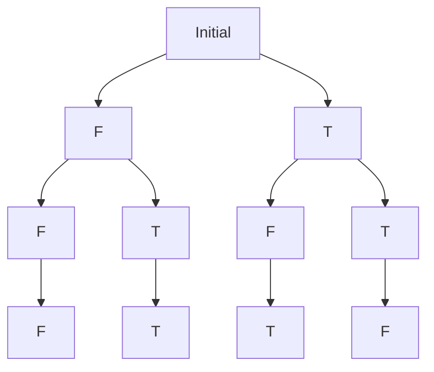

# Effect handlers

> A way to define control-flow abstractions and dynamic binding as user defined
> handlers.


```koka
effect raise
  ctl raise( msg: string ) : a

> :t raise
(msg: string) -> raise a
```

- The effect declaration defines
    - a new type
    - operations belonging to this type, in this case the only operation is a
      "control" operation (`ctl`)

It can be used like:

```koka
fun safe-divide( x : int, y : int ) : raise int
  if y==0 then raise("div-by-zero") else x / y
```

This newly created function can only be used in contexts, where the `raise`
effect is handled, meaning `raise` is dynamically bound.

The following snippet handles the effect, by just returning `42`:

```koka
fun raise-const() : int
  with handler
    ctl raise(msg) 42 
  8 + safe-divide(1,0)
```

By default, when an effect is yielded the most inner effect handler is
evaluated, the stack up to the handler is "unwinded" and the evaluated result
from the effect handler is returned.

> When handling an effect (e.g. raise) one speaks of "defining the dynamic
> binding of raise" or the "raise capability".

## Resuming

> "Resuming" enables to come back to the call site with a result

```koka
effect ask<a>
  ctl ask() : a

fun add-twice() : ask<int> int 
  ask() + ask()

fun ask-once() : int
  var count := 0
  with ctl ask()
    count := count + 1
    // resume with 42 on the first call, later just use 0
    if count <= 1 then resume(42) else 0   
  // Will return 0, because the second call does not resume anymore
  add-twice()
```

### Tail-resumptive operations

In practice most often `ctl`-operations resume with their value and do not
interrupt the control flow. This also allows better performance as
tail-resumptive functions can be called just like regular functions.

Because this is used often there exists snytactical sugar:

```koka
fun ask-const2() : int 
  with fun ask() 21
  add-twice() // returns 42
```

### Value handlers

Value handlers just return a static value. Define value effects as:

```koka
effect val width : int

// pretty has the width effect
fun pretty( d: string) : width string
  d.truncate(width)

fun pretty-thin() : string
  with val width = 5 // handle the width effect
  pretty("hello world")
```

### Abstracting Handlers into separate functions

Since with works with any function that receives a function as argument, it is
also possible to abstract handlers into separate functions:

```koka
effect fun emit( msg : string ) : ()

fun ehello() : emit ()
  emit("hello")
  emit("world")

fun emit-console( action )
  with fun emit(msg) println(msg) 
  action()

fun ehello-console() : console ()
  with emit-console
  ehello()
```

The following example defines a generic catch method to handle the `raise` effect:

```koka
// runs the action, and handles raise using the given hnd-function
fun catch( hnd: (string) -> e a, action : () -> <raise|e> a) : e a
  with ctl raise(msg) hnd(msg)
  action()

fun catch-example()
  with catch( fn(msg) { println("error: " ++ msg); 42 }) // handles raise
  safe-divide(1,0)
```

### Return Operations

> The return operation of a handler transforms the return value of a function accessing
a handler.


Consider the following example using a state:

```koka
effect state<a>
  fun set( x: a ): ()
  fun get(): a

// set the state
fun modify( x: int ) : state<int> ()
  set(x)

fun use-state( value: int )
  var st := 0
  with handler
    // return modifies the result of every function using this handler
    return(_) st
    fun get() st
    fun set( x: int) 
      // only allow positive numbers
      if x >= 0 then 
        return st := x 
      else 
        return st := 0
  // altough modify returns (), return changes it to the current value of the
  state
  modify(value)
```

`return` could be used for instance in combination with the `raise` effect:

```koka
fun raise-maybe( action : () -> <raise|e> a ) : e maybe<a>
  with handler
    return(x)      Just(x)   // normal return: wrap in Just
    ctl raise(msg) Nothing   // exception: return Nothing directly  
  action()
```

> It is even possible to have a handler that only contains a single return
> operation: such handler handles no effect at all but only transforms the final
> result of a function.


### Combining effects

Effects can freely be combined by just writing several `with`s:

```koka
// if an error occurs just return Nothing
fun raise-either( action : () -> <raise|e> a ) : e either<string, a>
  with handler
    return(x)      Right(x)   // normal return: wrap in Just
    ctl raise(msg) Left(msg)  // if raise was called, wrap the message in Left
  action()

// the lowest allowed number in the state is 0
fun positive-state(init: int, action: () -> <state<int>|e> int): e int
  var st := init
  with handler
    fun get() st
    fun set( x: int) 
      if x >= 0 then 
        st := x 
      else 
        st := 0
  action()

// try to halve the number in the state
fun state-raise(init) : either<string, int>
  with raise-either
  with positive-state(init)
  val i = get()
  if i.is-odd then raise("Can't halve odd number") else
    set( i / 2 )
    i

fun result(init : int): console ()
  match state-raise(init)
    Right(x) -> println("result: " ++ x.show)
    Left(e) -> println(e)
```

### Masking effects

> An effect mask can be used to skip the most inner handler. `mask` gets
> discharged by the first effect handler, the real effect needs to be handled
> by another effect handler.

This is useful when an internal effect handler is provided, which should only
handle special cases:

```koka
fun mask-print( action : () -> e int ) : e int
  with ctl raise(msg) 42 
  val x = mask<raise>(action) // gets not handled by the internally defined raise handler
  if x.is-odd then raise("wrong")   // internal exception
  x

> :t mask-print
forall<e>. (action : () -> e int) -> e int
```

If mask had not been put in place, the type of `mask-print` would be:

```koka
forall<e>. (action : () -> <raise|e> int) -> e int
```

This is because we handle the `raise` effect Koka expects that `action` also
can produce a `raise` effect

*Overriding Handlers*

Look at the following behaviour:

```koka
fun emit-quoted1( action : () -> <emit,emit|e> a ) : <emit|e> a
  // emit gets handled here, but needs another handling! That's why action has this special inferred type
  with fun emit(msg) emit("\"" ++ msg ++ "\"") 
  action()
```

This can be fixed like:

```koka
fun emit-quoted1( action : () -> <emit|e> a ) : <emit|e> a
  with override fun emit(msg) emit("\"" ++ msg ++ "\"") 
  action()
```

### Resuming more than once

One can resume more than once, and then, for example gather the results in a list:

```koka
effect ctl choice() : bool

fun choice-all(action : () -> <choice|e> a) : e list<a>
  with handler
    // the result of the function needs to be stacked up in some way
    return(x)    [x] 
    // if choice is called, resume once with False and once with True
    ctl choice() resume(False) ++ resume(True) 
  action()
```

If `choice` is called the whole action is firstly evaluated with `False`
and then the function gets re-evaluated with `True`. If `choice` is called
multiple times, then it results in sort of tree!

Consider the following example, where `choice` is called twice:

```koka
fun xor() : choice bool
  val p = choice()
  val q = choice()
  if p then !q else q

> choice-all(xor)
[False, True, True, False]
```

The tree can look somewhat like the following:



Resuming multiple times gets even more interesting when combining with other
handlers, for example the following state handler `pstate`, which in the end
returns a tuple containing the result of `action` and the final state:

```koka
fun pstate( init : a, action : () -> <state<a>,div|e> b ) : <div|e> (b,a)
  var st := init
  with handler     
    return(x)  (x,st)       // pair with the final state
    fun get()  st
    fun set(i) st := i 
  action()
```

When we combine this handler of the state effect with the multi-resumption
handler of choice, we have two possibilities:

1. First handling the state, and then handling the choice
2. Vice versa

In the first case, the state stays the same over all resumptions, meaning the
resumptions share the stateha , whereas in the latter, the state is local to every
resumption:

```koka
// share the state over all resumptions
fun state-choice(action) : div (list<bool>,int) 
  pstate(0) // result is a tuple
    choice-all(action)  // result is a list

fun choice-state(action) : div list<(bool,int)>
  choice-all // result is a list
    pstate(0, action) // result is a tuple
```
### Initially and finally

> Since handlers can resume once, never or several times one must pay attention
> when interacting with external resources (e.g. files).

The `finally` function takes as its first argument a function that is always
executed exactly once when returning:

See the following example which works with a file and always closes it using
the `finally` function:

```koka
fun with-file( path : string, action : () -> <fread,exn,filesys|e> a ) : <exn,filesys|e> a
  val h = fopen(path)
  with finally 
    // close the file when returning
    hclose(h)
  with fun fread() 
    hreadline(h)
  action()
```

> Pay attention: this works when returning normally or in exception cases but
> when resuming twice, `finally` is called twice. This may be wanted but might
> also be a problem. Research is still ongoing on how to express this in the
> type system.

There is currently no documentation how initially works or what its exact syntax is.
